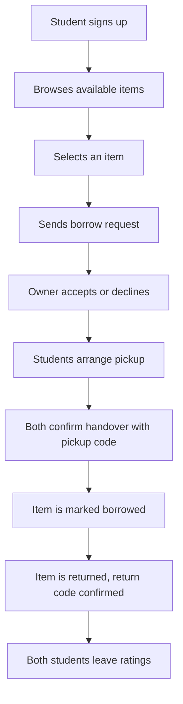

# BorrowCircle MVP Document (v2 — gaps closed)

## 1. Project Overview

**Project name:** BorrowCircle
**Type:** Web application
**Target users:** KNUST students
**MVP duration:** 4 weeks / 4 sprints
**Sprint length:** 1 week

BorrowCircle is a campus-only platform where verified students can list useful items they own and allow other students to borrow or rent them for a short period.

Instead of buying something they only need once, a student can find it nearby, request it, agree on a pickup time, and return it by the agreed date.

Examples of items:

* Scientific calculators
* Lab coats
* Textbooks and past questions
* Extension boards and power banks
* Cameras, tripods, and ring lights
* Drawing tools
* Football boots
* Event outfits

---

## 2. Problem Statement

Many students need items temporarily but cannot afford to buy them, do not know who to ask, or do not have access to a trusted borrowing system.

At the same time, many students own items they rarely use. BorrowCircle helps students find and borrow these items safely within their university community.

---

## 3. Proposed Solution

BorrowCircle provides a verified KNUST student marketplace for borrowing and renting items.

A student can:

1. Create an account using their student email.
2. List an item they want to lend or rent out.
3. Browse available items around campus.
4. Send a request to borrow an item.
5. Accept or decline requests as the item owner.
6. Confirm pickup and return with a simple handover code (new).
7. Track pickup and return dates.
8. Rate the borrower or lender after the item is returned.

---

## 4. MVP Goal

The MVP should prove one important thing:

> Can KNUST students safely discover, request, lend, and return useful items through one simple platform?

The first version will focus only on the borrowing flow. Payments, deposits, delivery, and advanced verification can come later.

---

## 5. Scope

### Included in the MVP

* Student registration, login, and password reset
* Student profile
* Item listing (up to 3 photos)
* Browse and search available items
* Filter by category and location (standardized dropdown)
* Sort by newest, price
* Borrow request flow
* Accept or decline requests
* Request auto-expiry if the lender doesn't respond
* Cancellation of a pending or accepted request
* Two-sided handover confirmation (pickup code + return code)
* Overdue flag on items not returned by the agreed date
* Item status management
* Basic in-app notifications
* Ratings after a completed return
* Basic reporting of a listing or user to admin

### Not included in the MVP

* Online payments
* Deposits and refunds
* Delivery service
* Live chat
* GPS tracking
* Multi-item / calendar-based future bookings (see note below)
* Formal admin dispute resolution (reports are logged, not adjudicated, in v1)
* Multiple universities
* Native mobile app
* AI recommendations

**Design-ahead note:** the DB schema below already includes the fields needed for future booking calendars and dispute handling, so v2 features don't require a schema rewrite — they're just left inactive in the MVP.

---

## 6. Primary Users

| User     | Description                                                                |
| -------- | -------------------------------------------------------------------------- |
| Borrower | A student looking for an item to borrow or rent temporarily.               |
| Lender   | A student listing an item they own.                                        |
| Admin    | A platform manager who can remove inappropriate items or suspend accounts. |

A user can be both a borrower and a lender.

---

## 7. Main User Journey



---

## 8. Core Features and User Stories

### Feature 1: Authentication

**User Story:**
As a KNUST student, I want to create an account, log in, and recover my password so that only verified students can use BorrowCircle.

**Acceptance Criteria:**

* User can register with name, email, password, hostel/location, and phone number.
* Email must be unique.
* Password must be at least 8 characters.
* User can log in and log out.
* User can request a password reset link by email.
* Unauthenticated users cannot create listings or send borrow requests.
* Only emails ending in the approved university domain are accepted.
* A user cannot register a second account with the same phone number.

---

### Feature 2: Student Profile

**User Story:**
As a student, I want to manage my profile so other students know who they are borrowing from or lending to.

**Acceptance Criteria:**

* User can view and edit name, phone number, hostel/location, profile photo, and bio.
* Profile shows the user's average rating.
* Profile shows items they have listed.
* Phone number is visible only after a request has been accepted.
* User can request account deletion; their listings and history are anonymized, not shown as active.

---

### Feature 3: List an Item

**User Story:**
As a lender, I want to add an item I own so that other students can request to borrow it.

**Acceptance Criteria:**

* Lender can add item name, description, category (from a fixed list), location (from a hostel/area dropdown), up to 3 images, borrowing type, price, and availability.
* Borrowing type can be `Free` or `Paid`.
* Price is required only for paid listings.
* Lender can edit or delete an item before it is borrowed.
* Lender can pause a listing (`Unavailable`) without deleting it.
* A newly created item appears in the public listing immediately.
* Item starts with the status `Available`.

**Example listing:**

```json
{
  "title": "Casio Scientific Calculator",
  "description": "Good condition. Suitable for engineering and science courses.",
  "category": "Electronics",
  "location": "Unity Hall",
  "borrowType": "PAID",
  "pricePerDay": 5,
  "status": "AVAILABLE"
}
```

---

### Feature 4: Browse and Search Items

**User Story:**
As a borrower, I want to browse, search, and sort items so that I can quickly find what I need.

**Acceptance Criteria:**

* Users can see all available items.
* Users can search by item name or description.
* Users can filter by category and by standardized location.
* Users can sort by newest first or price (low to high / high to low).
* Unavailable, reserved, borrowed, or admin-removed items do not appear in normal search results.
* If no item matches, show a clear empty-state message.

---

### Feature 5: Send a Borrow Request

**User Story:**
As a borrower, I want to request an item for specific dates so that the owner can decide whether to lend it to me.

**Acceptance Criteria:**

* Borrower chooses a pickup date and return date.
* Return date must be after pickup date.
* Borrower can add a short message.
* A borrower cannot request their own item.
* A borrower cannot submit duplicate pending requests for the same item.
* The item owner receives a notification.
* If the owner does not respond within 48 hours, the request auto-expires and the borrower is notified.
* Either party can cancel a pending request before it's accepted; the borrower can cancel an accepted request before pickup, which returns the item to `Available`.

---

### Feature 6: Manage Requests

**User Story:**
As a lender, I want to accept or decline requests so that I control who borrows my item.

**Acceptance Criteria:**

* Lender can see pending requests for each listed item.
* Lender can accept one request at a time; acceptance is handled as an atomic operation so two requests can't be accepted simultaneously.
* When accepted, the item becomes `Reserved`.
* Other pending requests are automatically declined with a system message.
* Lender can decline a request and provide an optional reason.
* Only the owner of an item can manage its requests.

---

### Feature 7: Handover, Tracking, and Returns

**User Story:**
As a borrower and lender, I want to confirm handover and track active borrowing agreements so both people know the item was exchanged and when it should come back.

**Acceptance Criteria:**

* On acceptance, the system generates a one-time pickup code shown to the borrower.
* Lender enters the borrower's pickup code to confirm handover; item status becomes `Borrowed`.
* On the return date, the system generates a one-time return code shown to the lender.
* Borrower enters the lender's return code to confirm return; item status becomes `Available`.
* If the return date passes with no confirmed return, the item is flagged `Overdue` and both users are notified daily until resolved.
* Both users receive a notification at every status change.

---

### Feature 8: Item Status Management (new)

**User Story:**
As a lender, I want to pause or cancel a listing so that borrowers aren't requesting an item that's no longer available.

**Acceptance Criteria:**

* Only the owner who posted the item can change its status.
* A lender can manually mark an item as `Paused` (temporarily unavailable) or `Cancelled` (withdrawn) from their dashboard.
* Cancelling an item that has a `Pending` or `Accepted` request automatically cancels that request and notifies the affected borrower.
* A cancelled item is removed from the public listing and shown as `Cancelled` in the lender's dashboard.
* A paused item can be reactivated by the lender at any time; a cancelled item cannot be reactivated and must be re-listed.

---

### Feature 9: Personal Dashboard (new)

**User Story:**
As any user, I want a personal dashboard where I can see all my activity so that I can track my lending and borrowing in one place.

**Acceptance Criteria:**

* The dashboard has two sections: `Items I'm Lending` and `Items I've Borrowed`.
* Each entry shows the item title, pickup/return date, current status, and availability.
* Pending, accepted, and declined requests are visually distinguished (e.g. by color or badge).
* This dashboard replaces the separate "My Listings," "My Requests," and "Borrowing Dashboard" pages from the original page list with a single unified view.

---

### Feature 10: Notifications (new)

**User Story:**
As a user, I want to receive in-app notifications about important activity so that I don't have to repeatedly check my dashboard for updates.

**Acceptance Criteria:**

* A notification is created when:
  * A borrower requests to borrow a lender's item.
  * A lender accepts a borrower's request.
  * A lender declines a borrower's request.
  * A borrower withdraws from or cancels an accepted request.
  * A lender cancels an item involving a `Pending` or `Accepted` request.
  * A lender makes a material change to a listing involving an `Accepted` request (e.g. changes the pickup date or price).
* Notifications contain enough context to understand the event, such as the relevant item name.
* Notifications display their creation date/time.
* Notifications have `Read` and `Unread` states.
* The application displays an unread notification count/badge.
* A user can mark an individual notification as read.
* A user can mark all notifications as read.
* Selecting a notification takes the user to the relevant item or request.

---

### Feature 11: Ratings

**User Story:**
As a student, I want to rate the other person after an item is returned so that the platform becomes safer and more trustworthy.

**Acceptance Criteria:**

* Ratings are available only after an item is marked returned.
* Rating range is 1 to 5 stars.
* User may add a short review.
* A user can rate the other participant only once per borrowing agreement.
* Average rating is shown on the student profile.

---

### Feature 12: Reporting

**User Story:**
As a student, I want to report a listing or a user so that admin can review bad behavior.

**Acceptance Criteria:**

* User can report an item listing or another user with a reason and optional note.
* Report is logged and visible to admin with status `Open` or `Reviewed`.
* Admin can mark a report reviewed and, if needed, remove the listing or suspend the account.
* v1 does not include automated resolution or messaging back to the reporter — this is manual admin review only.

---

## 9. Core Pages

| Page                | Purpose                                                            |
| ------------------- | ------------------------------------------------------------------ |
| Landing Page        | Explains BorrowCircle and directs users to sign up or log in.      |
| Sign Up / Login     | Student authentication, including password reset.                 |
| Home / Explore      | Shows available items, categories, search, filters, and sort.      |
| Item Details        | Shows item information, lender profile, and borrow request button. |
| Create Listing      | Lets a lender add an item.                                         |
| Dashboard           | Two sections — "Items I'm Lending" and "Items I've Borrowed" — showing status, dates, and pending/accepted/declined requests. Replaces separate My Listings/My Requests/Borrowing Dashboard pages. |
| Profile             | Lets users edit personal details and view ratings.                 |
| Notifications       | Shows request, acceptance, rejection, cancellation, handover, and return updates, with read/unread state and a badge count. |
| Admin Dashboard     | Removal of listings, account suspension, and report review.        |

---

## 10. Suggested Database Design

### `users`

| Field             | Type      | Description           |
| ----------------- | --------- | ---------------------- |
| id                | UUID      | Primary key            |
| full_name         | VARCHAR   | Student's name         |
| email             | VARCHAR   | Unique student email   |
| password_hash     | VARCHAR   | Encrypted password     |
| phone_number      | VARCHAR   | Contact number, unique |
| location          | VARCHAR   | Hostel or campus area (from fixed list) |
| profile_image_url | TEXT      | Optional photo         |
| bio               | TEXT      | Short description      |
| average_rating    | DECIMAL   | User's rating average  |
| role              | ENUM      | `USER` or `ADMIN`      |
| status            | ENUM      | `ACTIVE`, `SUSPENDED`, `DELETED` |
| created_at        | TIMESTAMP | Account creation time  |

### `items`

| Field         | Type      | Description                                                     |
| ------------- | --------- | ----------------------------------------------------------------- |
| id            | UUID      | Primary key                                                        |
| owner_id      | UUID      | References user who owns the item                                 |
| title         | VARCHAR   | Item name                                                          |
| description   | TEXT      | Item details                                                       |
| category      | VARCHAR   | From fixed category list                                           |
| location      | VARCHAR   | Pickup area, from fixed list                                       |
| image_urls    | TEXT[]    | Up to 3 item photos                                                |
| borrow_type   | ENUM      | `FREE` or `PAID`                                                   |
| price_per_day | DECIMAL   | Optional rental cost                                               |
| status        | ENUM      | `AVAILABLE`, `RESERVED`, `BORROWED`, `OVERDUE`, `PAUSED`, `CANCELLED`, `REMOVED` |
| created_at    | TIMESTAMP | Listing creation time                                              |

### `borrow_requests`

| Field             | Type      | Description                                                                       |
| ----------------- | --------- | ---------------------------------------------------------------------------------- |
| id                | UUID      | Primary key                                                                         |
| item_id           | UUID      | Requested item                                                                      |
| borrower_id       | UUID      | Student requesting the item                                                         |
| pickup_date       | DATE      | Planned pickup date                                                                 |
| return_date       | DATE      | Planned return date                                                                 |
| message           | TEXT      | Optional request message                                                           |
| pickup_code       | VARCHAR   | One-time code for handover confirmation                                            |
| return_code       | VARCHAR   | One-time code for return confirmation                                              |
| status            | ENUM      | `PENDING`, `ACCEPTED`, `DECLINED`, `EXPIRED`, `CANCELLED`, `BORROWED`, `RETURNED`, `OVERDUE` |
| expires_at        | TIMESTAMP | Auto-expiry time for pending requests                                              |
| created_at        | TIMESTAMP | Request creation time                                                              |

### `ratings`

| Field             | Type      | Description                   |
| ----------------- | --------- | ------------------------------ |
| id                | UUID      | Primary key                    |
| borrow_request_id | UUID      | Completed borrowing agreement  |
| reviewer_id       | UUID      | Person leaving the rating      |
| reviewee_id       | UUID      | Person being rated              |
| score             | INTEGER   | Rating from 1–5                |
| comment           | TEXT      | Optional review                |
| created_at        | TIMESTAMP | Rating creation time           |

### `notifications`

| Field       | Type      | Description                                                        |
| ----------- | --------- | -------------------------------------------------------------------- |
| id          | UUID      | Primary key                                                           |
| user_id     | UUID      | Notification recipient                                                |
| type        | ENUM      | `REQUEST_SENT`, `REQUEST_ACCEPTED`, `REQUEST_DECLINED`, `REQUEST_CANCELLED`, `ITEM_CANCELLED`, `ITEM_CHANGED`, `HANDOVER_CONFIRMED`, `RETURN_CONFIRMED`, `OVERDUE` |
| title       | VARCHAR   | Notification heading                                                  |
| message     | TEXT      | Notification content                                                  |
| target_type | ENUM      | `ITEM` or `BORROW_REQUEST` — what the notification links to           |
| target_id   | UUID      | ID of the linked item or request, used for click-through              |
| is_read     | BOOLEAN   | Read status                                                            |
| created_at  | TIMESTAMP | Notification time                                                      |

### `reports` (new)

| Field       | Type      | Description                                  |
| ----------- | --------- | ---------------------------------------------- |
| id          | UUID      | Primary key                                     |
| reporter_id | UUID      | User filing the report                          |
| target_type | ENUM      | `ITEM` or `USER`                                |
| target_id   | UUID      | ID of the reported item or user                 |
| reason      | VARCHAR   | Short reason category                            |
| note        | TEXT      | Optional detail                                  |
| status      | ENUM      | `OPEN`, `REVIEWED`                               |
| created_at  | TIMESTAMP | Report creation time                             |

---

## 11. Suggested Tech Stack

| Area               | Suggested Technology           |
| ------------------ | ------------------------------- |
| Frontend           | React + TypeScript + Vite       |
| Styling            | Tailwind CSS                    |
| Backend            | Node.js + Express + TypeScript  |
| Database           | PostgreSQL                      |
| ORM                | Drizzle ORM or Prisma           |
| Authentication     | Better Auth or JWT              |
| Email (password reset, request expiry) | Resend or SendGrid |
| File Storage       | Supabase Storage or Cloudinary  |
| Database Hosting   | Supabase, Neon, or Railway      |
| Backend Hosting    | Railway or Render                |
| Frontend Hosting   | Vercel                           |
| Version Control    | GitHub                           |
| Project Management | Jira or GitHub Projects          |

---

## 12. Product Backlog

| ID    | User Story                                        | Priority |   Sprint |
| ----- | -------------------------------------------------- | -------: | -------: |
| BC-01 | User can register and log in                        |     High | Sprint 1 |
| BC-02 | User can create and edit a profile                  |     High | Sprint 1 |
| BC-03 | Lender can create an item listing                   |     High | Sprint 1 |
| BC-04 | User can view available items                       |     High | Sprint 1 |
| BC-05 | User can search, filter, and sort items             |     High | Sprint 2 |
| BC-06 | Borrower can send a request                          |     High | Sprint 2 |
| BC-07 | Lender can accept or decline a request               |     High | Sprint 2 |
| BC-08 | Item availability updates automatically              |     High | Sprint 2 |
| BC-09 | Pending requests auto-expire after 48 hours          |   Medium | Sprint 2 |
| BC-10 | Users can cancel a pending or accepted request       |   Medium | Sprint 2 |
| BC-11 | Users can see their listings and requests            |     High | Sprint 3 |
| BC-12 | Users confirm handover with pickup/return codes      |     High | Sprint 3 |
| BC-13 | Items flag as overdue if not returned on time        |   Medium | Sprint 3 |
| BC-14 | Users receive in-app notifications                   |   Medium | Sprint 3 |
| BC-15 | Users can rate each other after return               |   Medium | Sprint 4 |
| BC-16 | Users can report a listing or user                   |   Medium | Sprint 4 |
| BC-17 | Admin can manage users, listings, and reports        |   Medium | Sprint 4 |
| BC-18 | User can reset a forgotten password                  |     High | Sprint 1 |
| BC-19 | Responsive mobile-friendly interface                 |     High | Sprint 4 |
| BC-20 | Deploy application and complete testing              |     High | Sprint 4 |
| BC-21 | Lender can pause or cancel a listing                 |     High | Sprint 2 |
| BC-22 | Unified dashboard: "Items I'm Lending" / "Items I've Borrowed" |     High | Sprint 3 |
| BC-23 | Expanded notification events, read/unread, badge, click-through |   Medium | Sprint 3 |

---

## 13. Sprint Plan

## Sprint 1 — Foundation, Auth, and Listings

**Goal:** Users can register, log in, reset a password, and list available items.

### Sprint Backlog

| Task                                          | Owner              |
| ---------------------------------------------- | ------------------- |
| Set up GitHub repository and branch rules      | Team                |
| Create frontend and backend project structure  | Developers          |
| Set up PostgreSQL database and ORM              | Backend Developer   |
| Create database tables for users and items      | Backend Developer   |
| Implement authentication + password reset       | Backend Developer   |
| Build registration, login, and reset pages       | Frontend Developer  |
| Build home page and navigation                    | Frontend Developer  |
| Create "Add Item" form (with multi-photo upload)  | Frontend Developer  |
| Create item listing API                            | Backend Developer   |
| Display available items on home page                | Full-stack Team     |
| Add basic form validation                            | Full-stack Team     |

### Sprint 1 Deliverable

A student can sign up, log in, reset a password, create an item listing, and see available items on the home page.

---

## Sprint 2 — Borrowing Requests, Expiry, and Cancellation

**Goal:** Students can request items, owners can manage those requests, and stale or unwanted requests resolve themselves.

### Sprint Backlog

| Task                                                | Owner              |
| ----------------------------------------------------- | ------------------- |
| Create `borrow_requests` table                          | Backend Developer   |
| Create borrow request API                                | Backend Developer   |
| Prevent duplicate requests                                | Backend Developer   |
| Prevent users from requesting their own items              | Backend Developer   |
| Create accept/decline APIs with atomic locking              | Backend Developer   |
| Update item status after acceptance                          | Backend Developer   |
| Add 48-hour auto-expiry job for pending requests               | Backend Developer   |
| Add cancellation endpoint (pending and accepted)                | Backend Developer   |
| Add pause/cancel-listing endpoint, restricted to owner            | Backend Developer   |
| Auto-cancel affected request when a listing is cancelled            | Backend Developer   |
| Build "pause/cancel listing" controls in item management UI          | Frontend Developer  |
| Build item details page                                         | Frontend Developer  |
| Build borrow request modal/form                                    | Frontend Developer  |
| Build "My Requests" page                                             | Frontend Developer  |
| Build "Requests for My Items" page                                    | Frontend Developer  |
| Add search, filters (category/location), and sort                       | Full-stack Team     |

### Sprint 2 Deliverable

A borrower can request an item, the owner can accept or decline, and the system automatically clears expired or cancelled requests.

---

## Sprint 3 — Handover, Dashboard, and Notifications

**Goal:** Students can confirm pickup/return with codes, track agreements, and see overdue flags.

### Sprint Backlog

| Task                                                       | Owner              |
| ------------------------------------------------------------ | ------------------- |
| Create notifications table and API, with type/target fields         | Backend Developer   |
| Generate pickup/return codes on acceptance                        | Backend Developer   |
| Create handover confirmation endpoint (pickup code)                 | Backend Developer   |
| Create return confirmation endpoint (return code)                     | Backend Developer   |
| Create overdue-flag job (runs daily after return date passes)           | Backend Developer   |
| Automatically return item to available status on confirmed return          | Backend Developer   |
| Trigger notifications for all events (request sent/accepted/declined/cancelled, item cancelled or changed, handover, return, overdue) | Backend Developer |
| Build unified dashboard ("Items I'm Lending" / "Items I've Borrowed") with status badges | Frontend Developer |
| Build handover/return code UI                                                  | Frontend Developer  |
| Build notifications dropdown with unread badge, mark-as-read, and click-through | Frontend Developer  |
| Test complete lending flow, including overdue and cancellation cases                | QA / Team            |

### Sprint 3 Deliverable

Students can follow an item from request to accepted, confirmed handover, tracked borrowing, confirmed return, and back to available — with overdue items flagged automatically, a unified dashboard showing everything they're lending and borrowing, and notifications for every status change.

---

## Sprint 4 — Trust, Reporting, Admin, Testing, and Deployment

**Goal:** Make the platform reliable and safe enough for a small KNUST pilot.

### Sprint Backlog

| Task                                            | Owner              |
| -------------------------------------------------- | ------------------- |
| Create ratings table and API                          | Backend Developer   |
| Build rating and review interface                        | Frontend Developer  |
| Display average rating on profiles                          | Full-stack Team     |
| Create `reports` table and API                                 | Backend Developer   |
| Build "report listing/user" UI                                    | Frontend Developer  |
| Build admin dashboard with report queue                              | Full-stack Team     |
| Allow admin to remove listings and suspend accounts                     | Backend Developer   |
| Add empty states and error messages                                        | Frontend Developer  |
| Make all pages responsive                                                     | Frontend Developer  |
| Test APIs and main user flows                                                    | Team                 |
| Fix bugs from testing                                                              | Team                 |
| Deploy frontend, backend, and database                                              | Team                 |
| Prepare demo data and final presentation                                              | Team                 |

### Sprint 4 Deliverable

A deployed, responsive MVP where KNUST students can lend, borrow, confirm handover, return, rate, and report — with basic admin oversight.

---

## 14. Definition of Done

A task is complete only when:

* The feature works according to its acceptance criteria.
* Required validation has been added.
* Errors are handled clearly.
* The API has been tested.
* The frontend works on mobile and desktop.
* Code has been reviewed by at least one teammate.
* The feature has been merged into the `develop` branch.
* The feature does not break existing functionality.

---

## 15. Testing Scenarios

### Authentication

* A user cannot register with an existing email or phone number.
* A user cannot log in with incorrect credentials.
* A user cannot access protected pages without logging in.
* A password reset link expires after a set time and can only be used once.

### Listings

* A user cannot create an item without a title or category.
* A paid item cannot be created without a price.
* A user cannot edit another person's item.
* A paused, borrowed, or removed item does not show in public browsing.

### Borrow Requests

* A user cannot request their own item.
* A user cannot request the same item twice while a request is pending.
* A request cannot have a return date before the pickup date.
* Only an item owner can accept or decline requests.
* An accepted item cannot be accepted by another borrower at the same time.
* A pending request past 48 hours auto-expires and notifies the borrower.
* A cancelled accepted request correctly returns the item to `Available`.

### Item Status Management

* Only the item's owner can pause or cancel it.
* Cancelling an item with a pending or accepted request cancels that request and notifies the borrower.
* A cancelled item does not appear in public browsing.
* A paused item can be reactivated by its owner; a cancelled item cannot.

### Dashboard

* "Items I'm Lending" only shows items owned by the logged-in user.
* "Items I've Borrowed" only shows requests made by the logged-in user.
* Pending, accepted, and declined requests are visually distinct on the dashboard.

### Notifications

* Every listed trigger event (request sent, accepted, declined, cancelled; item cancelled or changed; handover; return; overdue) creates exactly one notification per affected user.
* The unread badge count matches the number of unread notifications.
* Marking one notification as read does not affect others.
* "Mark all as read" clears the unread badge.
* Clicking a notification opens the linked item or request.

### Handover and Returns

* An item cannot be marked `Borrowed` without a correct pickup code.
* An item cannot be marked `Returned` without a correct return code.
* An item not returned by its return date is flagged `Overdue` and both users are notified.

### Ratings

* Users cannot rate before an item is returned.
* A user cannot rate themselves.
* A user cannot submit more than one rating for the same borrowing agreement.

### Reporting

* A user can report a listing or another user with a reason.
* Only admin can change a report's status to `Reviewed`.

---

## 16. Success Metrics for the Pilot

The MVP can be considered successful if, within the first month of testing:

* At least 50 students register.
* At least 30 items are listed.
* At least 20 borrow requests are submitted.
* At least 10 items are successfully returned (confirmed via return code).
* Fewer than 10% of completed agreements are flagged overdue.
* At least 70% of pilot users say they would use the platform again.

---

## 17. Future Features After MVP

* Mobile app for Android and iOS
* MoMo payment integration
* Refundable security deposits
* Real-time chat between borrower and lender
* Item delivery service
* Calendar-based multi-booking per item (schema already supports this)
* Formal dispute resolution workflow built on top of the `reports` table
* Verified student ID badges
* Expansion to other Ghanaian universities
* "Request an Item" posts when no listing exists
* Recommended items based on location and frequently borrowed categories
